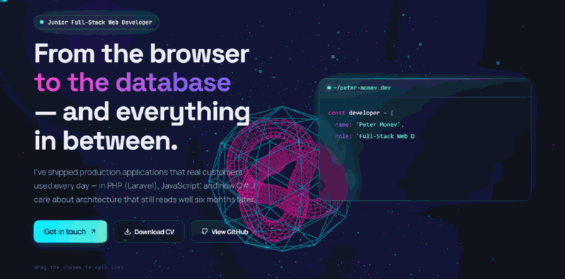

# Peter Monev — Interactive 3D CV 🎸

**Live:** https://peter-monev-cv-interactive.vercel.app/




<sub>The tour was recorded from the running site. Every scene in it is WebGL,
rendering live — the banding is the GIF format, which holds 256 colours, not
the page.</sub>

A CV you can walk around in. Seven WebGL scenes, a working terminal, and a
command palette — built with React 18, Three.js and Vite, in English and
Bulgarian.

The interesting part is not that the scenes exist. It is what it takes to run
seven of them on one page without the tab falling over.

---

## The problem this repository is really about

A browser grants roughly **16 WebGL contexts per process**. This page wants
seven, and a visitor with two tabs open wants fourteen. Go past the limit and
the browser silently takes one back — the canvas turns white and never
recovers on its own.

Three things keep that from happening.

**Scenes are built late.** `DeferredScene` mounts a scene only when it comes
near the viewport, on two independent triggers — an `IntersectionObserver` and
a rect check on scroll. Whichever fires first detaches the other, because a
single point of failure here means a permanently blank section.

**Scenes stop when nobody is looking.** Each render loop is gated by its own
observer, so a scene four screens away costs nothing.

**A lost context is caught, not fatal.** `createRenderer` returns `null`
instead of throwing — a throw inside an effect unmounts the React tree and
takes the whole page with it. `guardContext` listens for `webglcontextlost`
and rebuilds through a queue that spaces rebuilds apart, so five scenes losing
their contexts at once do not fight each other for the first one back.

Every scene also sits behind an error boundary. The page degrades to text; it
never degrades to blank.

---

## Other things worth reading

**Bloom over a transparent canvas** — `src/utils/bloom.js`.
`UnrealBloomPass` does not carry the scene's alpha through its composite; it
writes opaque pixels, which turns a transparent canvas into a solid rectangle
covering the page behind it. The scene's alpha is saved before the pass and
rebuilt after, so empty pixels become visible only in proportion to the light
that actually spilled onto them.

**The contact form sends from the browser** — `api/contact.js`.
Web3Forms sit behind bot protection that answers a datacentre request with a
challenge page, so a serverless function can never forward the mail. The
function verifies the Cloudflare Turnstile token and nothing else; the page
does the sending. A missing or wrong secret is treated as this server being
misconfigured rather than as the sender's fault, and the message goes through
anyway — a contact form that silently eats mail is worse than one that lets a
rare spam through.

**Reveal animations cannot hide the page** — `src/hooks/useReveal.js`.
Everything inside a `<Reveal>` starts invisible, so any failure to fire leaves
a section blank forever. The hidden state lives inside the animation rather
than as a resting style, and the observer has the same dual trigger the scenes
use.

**One type scale** — `src/styles/global.css`.
Twenty font sizes, ten of them crammed between 10.5 and 14.5px, are now nine
tokens on a ratio.

---

## What is on the page

* **Seven WebGL scenes** — a hero wireframe with an interactive starfield, a
  stat field, a timeline whose charge fills with scroll position, a
  certificate cloud, a skills galaxy with real lighting, a hologram projector
  that swaps in project screenshots, and a contact orb that reacts to what you
  type into the form.
* **A working terminal** — 16 commands: `about`, `experience`, `education`,
  `skills`, `projects`, `certs`, `contact`, `cv`, `whoami`, `goto`, `open`,
  `grep`, `help`, `clear`, `hire-me`, and `sudo`.
* **A command palette** — `Ctrl/Cmd + K`, with search across every section and
  credential.
* **Two case studies** — how RehearsalHub and the instruments marketplace are
  each put together, written from the repositories rather than from memory.
* **Two languages** — English and Bulgarian, switched without a reload.
* **A custom cursor** that opens over anything clickable, gets out of the way
  over text fields, and takes the colour of the section it is in.
* **Keyboard support** — a skip link, a focus trap in the palette, and no
  focusable element hidden behind an invisible face.
* **Matrix rain** — a 2D canvas effect behind the About section, not WebGL, so
  it costs no context.

---

## Stack

| | |
|---|---|
| Framework | React 18.3 |
| Build | Vite 5 |
| 3D | Three.js 0.165 |
| Animation | GSAP 3.15 |
| Icons | lucide-react |
| Analytics | @vercel/analytics |
| Styling | one plain CSS file, `src/styles/global.css` |
| Hosting | Vercel, with one serverless function in `api/` |

No UI library, no CSS framework, no state manager.

---

## Layout

```text
api/            serverless: Turnstile verification
public/         CV PDF, icons, social image
src/
  components/
    chrome/     nav, cursor, command palette, boot screen, footer
    sections/   one folder-level file per section, plus its 3D scene
    ui/         Reveal, LazyMount, flip cards, shared pieces
  data/         all copy and content, bilingual, no strings in components
  hooks/        reveal, scene generation, Turnstile
  i18n/         the two dictionaries
  styles/       global.css
  utils/        gfx, bloom, nebulae, canvas textures, motion
```

Content lives in `src/data`. Nothing user-facing is written inside a component.

---

## Run it

```bash
npm install
npm run dev
```

Then open http://localhost:5173.

The 3D, the terminal and both languages work with no configuration. Only the
contact form needs keys — copy `.env.example` to `.env` and fill in what you
want to test. Without them the form still renders; it just has nowhere to
send.

```bash
npm run build
npm run preview
```

---

## A note on the numbers

Anything measurable in this README was measured, not estimated. Where a
comment in the source quotes a figure — a pixel count, a threshold, a frame
budget — it came from reading the rendered output back, and the comment says
which. Several of them record something that turned out to be wrong the first
time.
